# Ahmed Mohamed

**Software Engineer** | B.S. Computer Science (May 2027), Luther College | Minors: Mathematics & Data Science

Full stack and backend engineer with intern and co-op experience in healthcare, enterprise software, and production systems. Open to SWE, backend, and new grad roles.

[Email](mailto:hussah01@luther.edu) · [LinkedIn](https://linkedin.com/in/ahmedmohamedh) · [Portfolio](https://portfolio-ahmed-mohameds-projects-0d275c62.vercel.app/)

---

## About

- Recent experience at **Mayo Clinic**, **Calero**, and **AImpulse** (full stack, APIs, caching, LLM QA, and production tooling)
- Build and ship products end to end: **ChessMate**, **CampusFound**, **ReturnRider**, and **retro_game_engine**
- Competitive chess player (**2150** on [Chess.com](https://www.chess.com/member/AhmeedM1), [Lichess](https://lichess.org/@/ahmed56781)); CS & Math TA, Chess Club President

---

## Selected Projects

| Project | Description | Stack |
| --- | --- | --- |
| [**ChessMate**](https://github.com/ahmed5145/ChessMate) | Production chess coaching platform with Stockfish analysis, async job pipelines, and personalized training reports ([Live](https://chess-mate.online)) | Python, Django, React, PostgreSQL, Redis, AWS |
| [**retro_game_engine**](https://github.com/ahmed5145/retro_game_engine) | Published Python game framework on PyPI with ECS architecture, CI, docs, and examples ([PyPI](https://pypi.org/project/retro-game-engine/)) | Python, Pygame, Poetry, pytest |
| [**CampusFound**](https://github.com/ahmed5145/CampusFound) | Mobile-first campus lost-and-found platform with photo uploads and searchable listings ([Demo](https://campus-found-kappa.vercel.app)) | Next.js, TypeScript, Supabase |
| [**ReturnRider**](https://github.com/ahmed5145/ReturnRider) | Return and refund tracking system with API, mobile app, email worker, and infrastructure automation | NestJS, Expo, PostgreSQL, Go |

---

## Technical Skills

**Languages:** Python, TypeScript, JavaScript, C#, Go, Java, SQL

**Frameworks:** React, Django, Node.js, .NET, FastAPI

**Data & ML:** pandas, scikit-learn, Semantic Kernel, PyTorch

**Databases & Infra:** PostgreSQL, MongoDB, Redis, Docker, AWS, Terraform, Git

---

## GitHub Overview

<div align="center">




<br /><br />



<br /><br />


</div>

<details>
<summary>Contribution snake (updates via GitHub Actions)</summary>

<picture>
  <source media="(prefers-color-scheme: dark)" srcset="./assets/github-snake-dark.svg" />
  <source media="(prefers-color-scheme: light)" srcset="./assets/github-snake.svg" />
  
</picture>

</details>

---

## Coding Activity

<!--START_SECTION:waka-->

```txt
From: 19 June 2026 - To: 26 June 2026

Total Time: 11 hrs 23 mins

JavaScript   7 hrs 6 mins          ██████████████▒░░░░░░░░░░   56.95 %
Python       2 hrs 41 mins         █████▒░░░░░░░░░░░░░░░░░░░   21.61 %
Other        1 hr 4 mins           ██▒░░░░░░░░░░░░░░░░░░░░░░   08.68 %
CSS          44 mins               █▒░░░░░░░░░░░░░░░░░░░░░░░   05.91 %
JSON         14 mins               ▒░░░░░░░░░░░░░░░░░░░░░░░░   01.87 %
Bash         11 mins               ▒░░░░░░░░░░░░░░░░░░░░░░░░   01.53 %
Markdown     11 mins               ▒░░░░░░░░░░░░░░░░░░░░░░░░   01.49 %
Text         4 mins                ░░░░░░░░░░░░░░░░░░░░░░░░░   00.66 %
```

<!--END_SECTION:waka-->

---

**Email:** [hussah01@luther.edu](mailto:hussah01@luther.edu)
